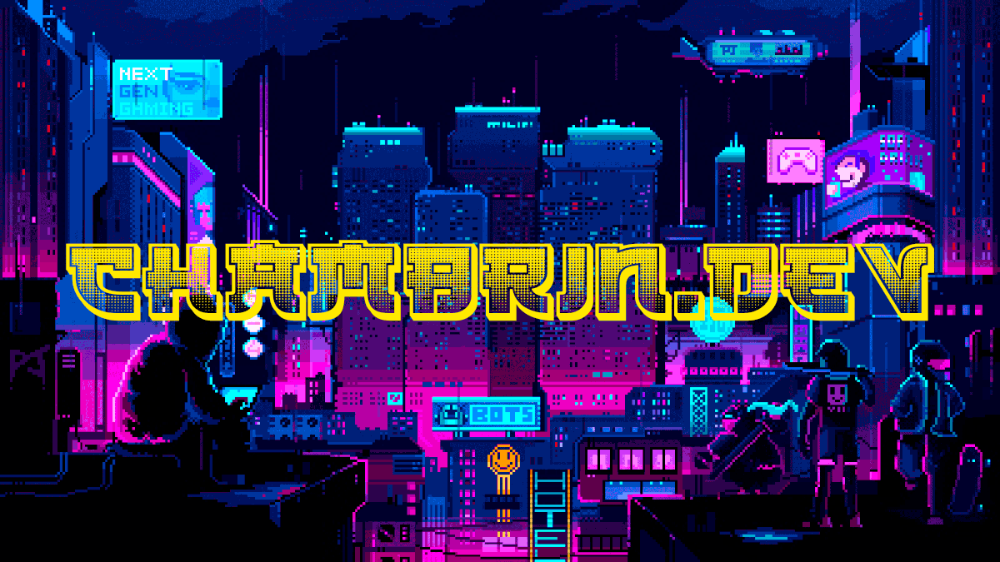

Hi My name is Chambrin
================================================================================================================================

Full-Stack Typescript Developer
-------------------------------

*   🌍  I'm based in France
*   ✉️  You can contact me at [contact@chambrin.dev](mailto:contact@chambrin.dev)
*   🚀  I'm currently working on [Next.gold](http://https://www.npmjs.com/package/next-gold)

### Skills 

                    

                    
 ### Socials
                  
                  

                      <a href="https://www.github.com/chambrin" target="_blank" rel="noreferrer">
                    <picture>
                    <source media="(prefers-color-scheme: dark)" srcset="https://raw.githubusercontent.com/danielcranney/readme-generator/main/public/icons/socials/github-dark.svg" />
                    <source media="(prefers-color-scheme: light)" srcset="https://raw.githubusercontent.com/danielcranney/readme-generator/main/public/icons/socials/github.svg" />
                    
                    </picture>
                    </a>

                    

